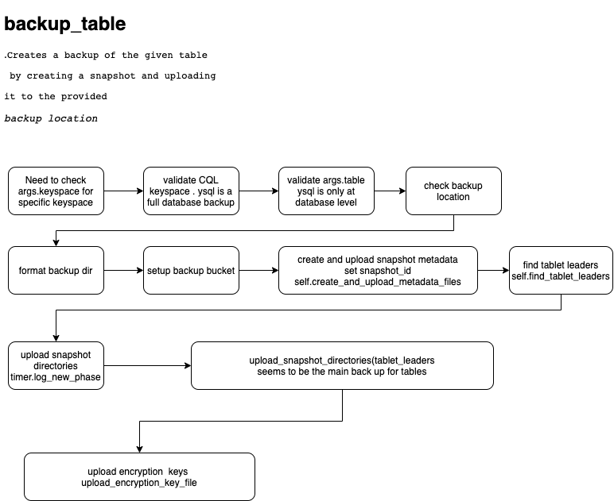

Ybbackup.backup_table


```

def backup_table(self):
    """
    Creates a backup of the given table by creating a snapshot and uploading it to the provided
    backup location.
    """
```

High level for for ybbackup_table


Diagram below is high level functional code and flow from 

